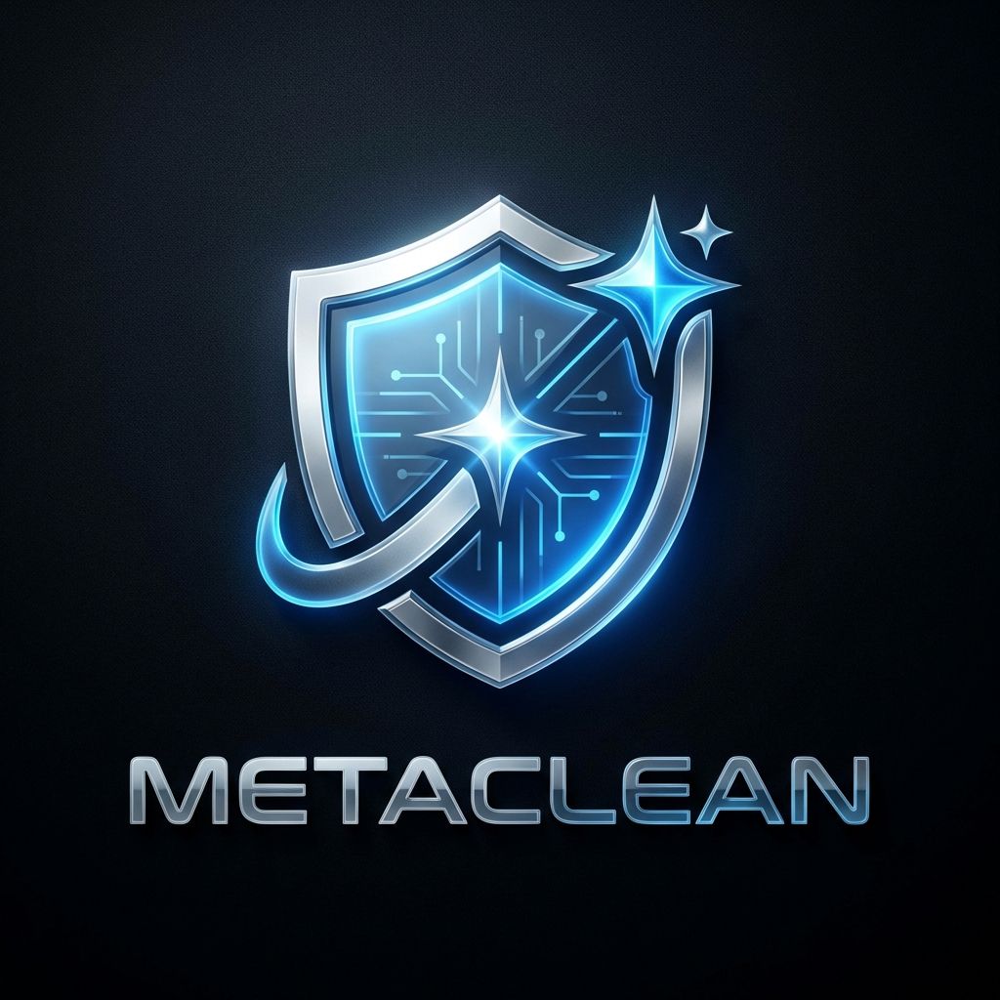

# 🛡️ MetaClean Pro


**MetaClean Pro** is a high-end, privacy-first metadata sanitizer designed for professionals who value data sovereignty. It allows you to strip hidden GPS coordinates, device information, and personal signatures from your files entirely within your browser or via a powerful CLI.

## ✨ Features

- **💎 Premium UI**: A sleek, dark-mode dashboard built with React, Tailwind, and Framer Motion.
- **🔒 Privacy First**: All processing happens client-side. Your files never touch a server.
- **🖼️ Deep Sanitize**: Uses Canvas-re-rendering to ensure absolute removal of all hidden metadata layers.
- **⚡ Fast & Efficient**: Batch processing support with real-time metadata detection.
- **💻 CLI Power**: A standalone Python script for automated, local batch processing.

---

## 🚀 Getting Started

### Web Application

1. **Clone the repo**:
   ```bash
   git clone https://github.com/joemunene-by/metadata-scrubber-tool.git
   cd metadata-scrubber-tool
   ```
2. **Install dependencies**:
   ```bash
   npm install
   ```
3. **Run locally**:
   ```bash
   npm run dev
   ```

### Command Line Interface (CLI)

The CLI tool is located in the `cli/` directory.

1. **Install requirements**:
   ```bash
   pip install Pillow
   ```
2. **Run the script**:
   ```bash
   python cli/metaclean.py -f path/to/image.jpg
   ```
   *For batch processing a directory:*
   ```bash
   python cli/metaclean.py -d path/to/images/
   ```

---

## 🛠️ Technology Stack

- **Frontend**: React, Vite, Tailwind CSS, Framer Motion
- **Icons**: Lucide React
- **Logic**: EXIF-JS, HTML5 Canvas API
- **CLI**: Python 3, Pillow

---

## 📸 Screenshots

<div align="center">
  
  <p><i>The Official MetaClean Identity</i></p>
</div>

---

## 🤝 Contributing

Contributions are welcome! Please feel free to submit a Pull Request.

## 📄 License

MIT License - Copyright (c) 2026 MetaClean Pro
